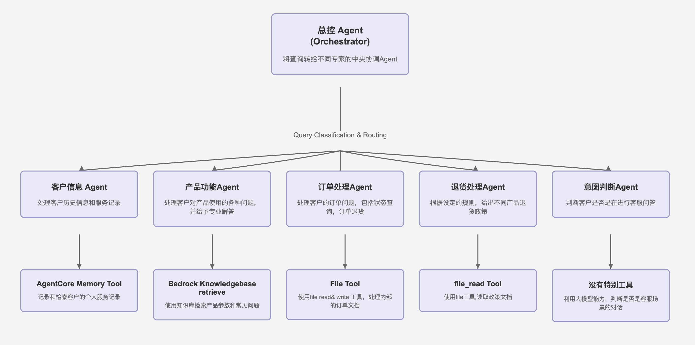

## multi-agent-for-customer-support

### 介绍
基于Strands SdK的multi-agent模式, 使用AWS bedrock AgentCore Runtime， Memory， Bedrock knowledgebase  等云原生agent infra 实现的制造业售后服务系统。

### 1.目的
旨在明确定义一个由多Agent组成的智能客服系统。该系统的设计目标是自动化和优化客户服务流程，提升客户满意度，并提高内部运营效率。系统将由一个总控Agent、一个客户沟通Agent和一个内部订单状态处理Agent协同工作，为客户提供无缝、高效的服务体验。

### 2.系统架构
本系统采用分层的多Agent架构，由用户接口层、应用逻辑层和数据存储层组成。Multi-Agent位于应用逻辑层，通过协同工作来完成客户服务任务。

*   **用户接口层**: 支持Web service 接口的方式，暴露服务。
*   **应用逻辑层**:
    *   **总控Agent**: 作为系统的“大脑”，接收所有来自用户的请求，并将任务分发给不同的agent。
    *   **客户信息管理Agent**: 作为客户历史信息的管理者，记录客户的历史行为。
    *   **问题咨询Agent**: 作为产品专家，给予客户专业回复。
    *   **内部订单状态处理Agent**: 作为系统的“手和脚”，执行具体的后台操作。
*   **数据存储层**: 包括知识库、客户信息数据库、订单数据库和对话历史记录。

### 3. 工作流程
1. 首先判断是否是闲聊，如果是闲聊，请回答：这里是客户电话，无法回答此类问题。
2. 如果不知道客户名称,请先询问客户的 user id，不要有别的回答
3. 根据客户提供的user id，使用update_user_id，更新user id， 并获取历史对话记录
4. 使用user_id查询订单号，并将订单情况发送给客户，得到客户肯定后，再继续处理客户问题
5. 根据客户的回复，选择不同的专家对客户做支持
6. 如果多次解答，问题依旧没有解决，请转人工服务，或建议客户退货
#### 架构图


### 4. 测试&部署
#### 4.1 Install Dependencies
```bash
uv sync
```

#### 4.2 Configure AWS
```bash
export AWS_ACCESS_KEY_ID="your-key"
export AWS_SECRET_ACCESS_KEY="your-secret"
export AWS_DEFAULT_REGION="us-east-1"
```

#### 4.3 Create Knowledge Base
1. Upload documents to S3
2. Create KB in Bedrock Console
3. Copy KB ID

#### 4.4 Create Agentcore Memory
```bash
python create_memory.py
```

#### 4.5 Update Config
update parameters
Edit `config/bedrock_config.py`:
```python
KNOWLEDGE_BASE_ID = "your-actual-kb-id"
BEDROCK_AGENTCORE_MEMORY_ID = "your-memory-id"
```

#### 4.6 Run test
```bash
uv run uvicorn main:app --host 0.0.0.0 --port 8080
```
```bash
curl -X POST http://localhost:8080/invocations   -H "Content-Type: application/json"   -d '{ "input": {"prompt": "你好，我购买的东西有问题"}}' 
```
#### 4.7 Deploy to Bedrock Agentcore runtime
refer：
https://strandsagents.com/latest/documentation/docs/user-guide/deploy/deploy_to_bedrock_agentcore/#option-b-custom-agent


1.Please provide a SAP OData Data Connection and configure a test data table that can be accessed via this connection. The OData connection must follow this format: https://<hostname>:<port>/sap/opu/odata/sap/<service_name>, and use the HTTPS protocol.
2.Could we either launch a Windows EC2 instance, or have your team configure a Windows server? This server will be used for the configuration of SAP and Redshift services, with an estimated cost of approximately $200 per month.